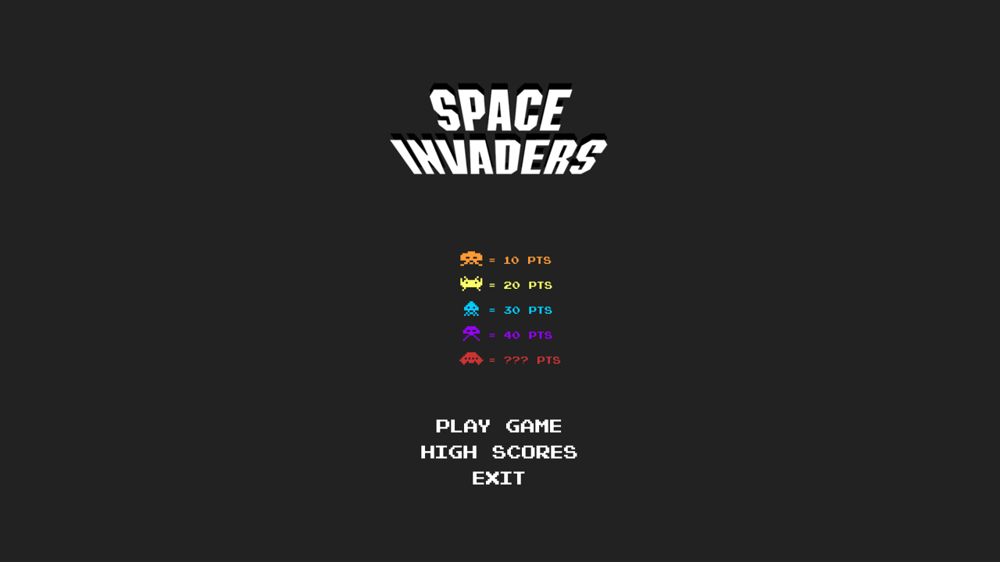
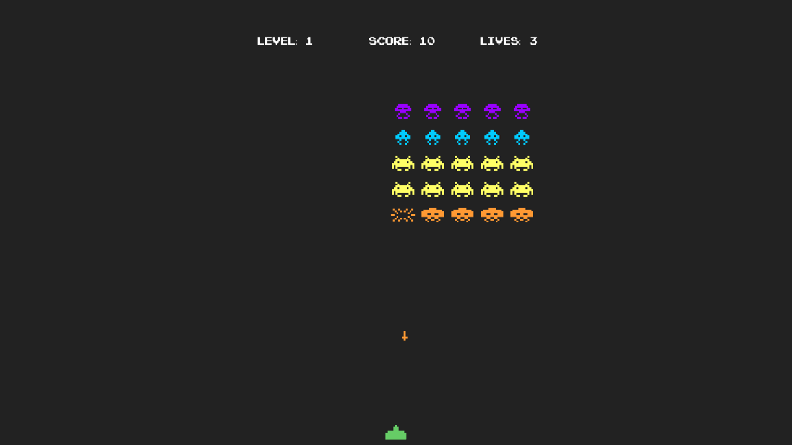

# Instrumental Space Invaders
Instrumental Space Invaders (sound input controls the spaceship)

# Overview
A friend asked me to collaborate in a project for her master's dissertation. Her project _aims to understand and explore the potential and artistic challenges opened by the inclusion of elements of game in the media._
One of the case studies, involved studying the possibility of using sound input to control the game mechanics, and the Space Invaders was chosen as a prototype. This project is the result of that collaboration. 

__Check the video or dissertation for more information:__

* Check out a video of the game [here](https://vimeo.com/277650562).

* The dissertation (in portuguese) [here](https://repositorio-aberto.up.pt/handle/10216/114355).

Authors:
* Inês Caldas (programmer)
* Margarida Pessoa (sound controls)

